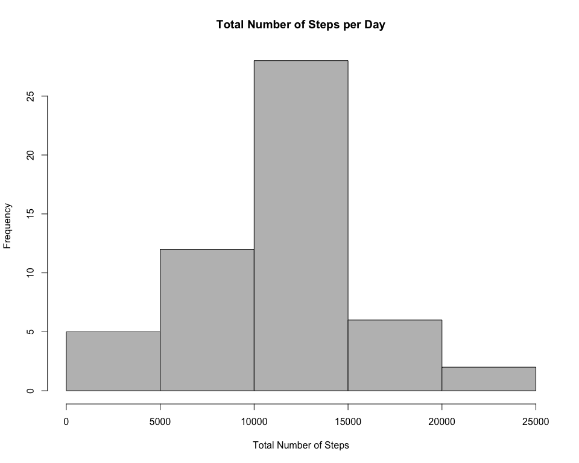
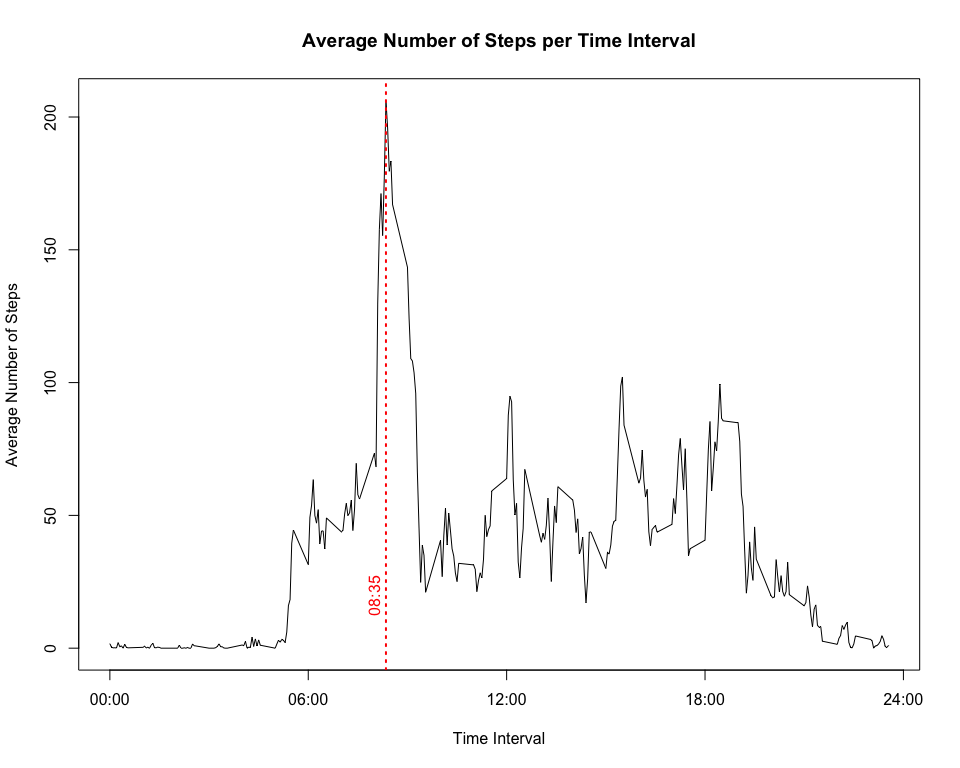
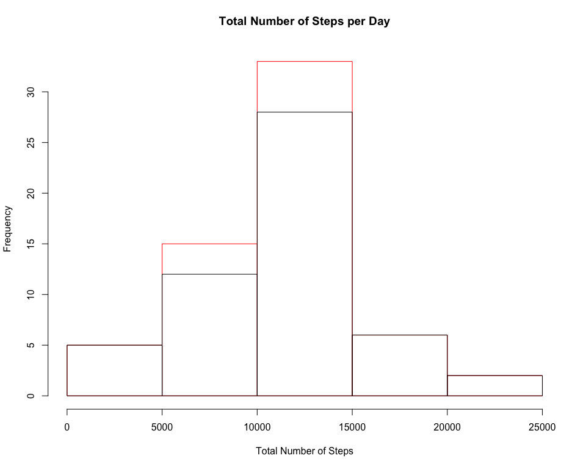
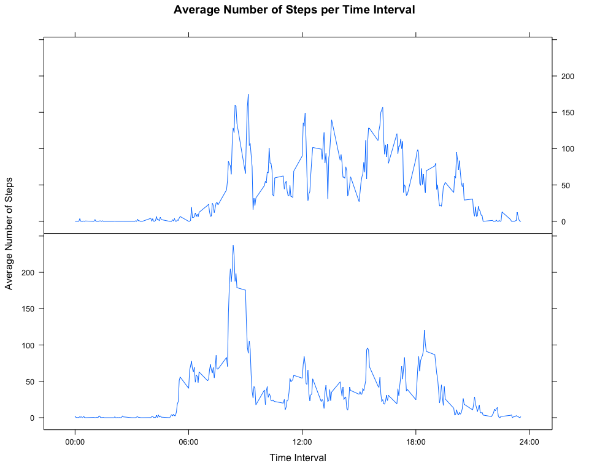

# Reproducible Research: Peer Assessment 1
Tulin Varol  
9/7/2017  


This document includes the assignment for Week 2 of the Coursera course "Reproducible Research".
This assignment makes use of data from a personal activity monitoring device. 
This device collects data at 5 minute intervals through out the day. 
The data consists of two months of data from an anonymous individual collected during the months of October and November, 2012 and include the number of steps taken in 5 minute intervals each day.

The variables included in this dataset are:

*  **steps**: Number of steps taking in a 5-minute interval (missing values are coded as NA)  
*  **date**: The date on which the measurement was taken in YYYY-MM-DD format  
*  **interval**: Identifier for the 5-minute interval in which measurement was taken

## Loading and preprocessing the data
The data exists as a zip file. Firstly, check if the data is unzipped already. If not, then unzip the data
and delete the existing zip file. After read the data with read.csv().

```r
if(!file.exists("activity.csv")){
    unzip("activity.zip")       
    file.remove("activity.zip")
}
data <- read.csv("activity.csv")
```
Let's have a quick look at the data.

```r
str(data)
```

```
## 'data.frame':	17568 obs. of  3 variables:
##  $ steps   : int  NA NA NA NA NA NA NA NA NA NA ...
##  $ date    : Factor w/ 61 levels "2012-10-01","2012-10-02",..: 1 1 1 1 1 1 1 1 1 1 ...
##  $ interval: int  0 5 10 15 20 25 30 35 40 45 ...
```
As you see, there are 17568 observables and 3 variables (steps, date, interval). Let's have a more detailed look.


```r
summary(data)
```

```
##      steps                date          interval     
##  Min.   :  0.00   2012-10-01:  288   Min.   :   0.0  
##  1st Qu.:  0.00   2012-10-02:  288   1st Qu.: 588.8  
##  Median :  0.00   2012-10-03:  288   Median :1177.5  
##  Mean   : 37.38   2012-10-04:  288   Mean   :1177.5  
##  3rd Qu.: 12.00   2012-10-05:  288   3rd Qu.:1766.2  
##  Max.   :806.00   2012-10-06:  288   Max.   :2355.0  
##  NA's   :2304     (Other)   :15840
```

We now have a bit more information. There are 2304 missing values labelled as NA.
There are 288 measurements for each day. Notice that each interval period is 5 minutes so 288*5=1440 minutes give the number of minutes in a day. The maximum number of steps taken in a day is 806, etc..

Now, let's convert the date given in this dataset to another type since that would be useful in the future. 

```r
data$date <- as.Date(data$date, format = "%Y-%m-%d")
```

## What is mean total number of steps taken per day?
Let's first calculate the total number of steps taken per day. There are many ways to do it but here tapply function from dplyr package will be used. Thus, the first step is to load the package.


```r
library(dplyr)
totalSteps <- tapply(data$steps, data$date, sum)
head(totalSteps)
```

```
## 2012-10-01 2012-10-02 2012-10-03 2012-10-04 2012-10-05 2012-10-06 
##         NA        126      11352      12116      13294      15420
```
This can be visualized by plotting the histogram of the total number of steps taken each day. 

```r
hist(totalSteps, main="Total Number of Steps per Day", xlab="Total Number of Steps", col="grey")
```

<!-- -->

Let's look at the mean and median number of steps taken each day. In order to have sensible results, NAs will be removed.

```r
mean(totalSteps, na.rm =TRUE)
```

```
## [1] 10766.19
```

```r
median(totalSteps, na.rm =TRUE)
```

```
## [1] 10765
```

So the mean number of steps taken per day is 10766 and the median is 10765.

## What is the average daily activity pattern?
Now in order to see the average daily activity pattern, the 5 min interval vs the average number of steps taken will be plotted.


```r
aveInterval <- tapply(data$steps, data$interval, mean, na.rm=TRUE)
head(aveInterval)
```

```
##         0         5        10        15        20        25 
## 1.7169811 0.3396226 0.1320755 0.1509434 0.0754717 2.0943396
```

```r
plot(as.numeric(as.character(names(aveInterval))), as.numeric(as.character(aveInterval)), 
     type="l",
     xlab="Time Interval", 
     ylab="Average Number of Steps", 
     main="Average Number of Steps per Time Interval",
     xaxt="n")
axis(1, at = seq(0, 2400, by = 600), labels = c("00:00","06:00","12:00","18:00","24:00"))
abline(v=names(aveInterval)[which.max(aveInterval)], col="red", lty="dotted", lwd=2)
text(x = names(aveInterval)[which.max(aveInterval)-7], y = 20, "08:35", srt = 90, col = "red")
```

<!-- -->

```r
names(aveInterval)[which.max(aveInterval)]
```

```
## [1] "835"
```

```r
max(aveInterval)
```

```
## [1] 206.1698
```

On average across all the days in the dataset, the time interval of 835 contains the maximum number of steps. That corresponds to 8:35 AM (shown by red line on the plot) when people take maximum number of steps, 206 steps on average, each day. 

## Imputing missing values
As we see before, there are many NAs in this dataset. To remind you again:


```r
summary(data)
```

```
##      steps             date               interval     
##  Min.   :  0.00   Min.   :2012-10-01   Min.   :   0.0  
##  1st Qu.:  0.00   1st Qu.:2012-10-16   1st Qu.: 588.8  
##  Median :  0.00   Median :2012-10-31   Median :1177.5  
##  Mean   : 37.38   Mean   :2012-10-31   Mean   :1177.5  
##  3rd Qu.: 12.00   3rd Qu.:2012-11-15   3rd Qu.:1766.2  
##  Max.   :806.00   Max.   :2012-11-30   Max.   :2355.0  
##  NA's   :2304
```

There are total of 2304 missing values in this dataset. There may be different ways of replacing these missing values by something meaningful. Here, they will be replaced by the mean number of steps for that given time interval across the other days. Now, we'll create a new dataset which will be equal to the original dataset but with the missing data filled in.


```r
imputedData <- data %>% mutate(day = weekdays(date)) %>% group_by(interval, day) %>% mutate(steps = replace(steps, is.na(steps), mean(steps, na.rm = TRUE)))
head(imputedData)
```

```
## Source: local data frame [6 x 4]
## Groups: interval, day [6]
## 
##      steps       date interval    day
##      <dbl>     <date>    <int>  <chr>
## 1 1.428571 2012-10-01        0 Monday
## 2 0.000000 2012-10-01        5 Monday
## 3 0.000000 2012-10-01       10 Monday
## 4 0.000000 2012-10-01       15 Monday
## 5 0.000000 2012-10-01       20 Monday
## 6 5.000000 2012-10-01       25 Monday
```

Since now we replaced the missing values, let's calculate the mean and median total number of steps taken per day.


```r
newTotalSteps <- tapply(imputedData$steps, imputedData$date, sum)
mean(newTotalSteps, na.rm =TRUE)
```

```
## [1] 10821.21
```

```r
median(newTotalSteps, na.rm =TRUE)
```

```
## [1] 11015
```

New mean and median values are 10821 and 11015, respectively. These values were 10766 and 10765 when NAs were removed. The difference is not too big. Now let's visualize this and check the histogram for total number of steps taken per day. 


```r
hist(newTotalSteps, xlab="Total Number of Steps", border="red", main=NA)
hist(totalSteps, xlab="Total Number of Steps", main=NA, border="black", add=TRUE)
title("Total Number of Steps per Day", line = 2)
```

<!-- -->

## Are there differences in activity patterns between weekdays and weekends?
Let's create a new column in the imputed dataset with two levels - "weekday" and "weekend" indicating whether a given day is a weekday or weekend day.

```r
library(lubridate)
imputedData$week <- factor(ifelse(wday(imputedData$date, label=TRUE) %in% c("Sat", "Sun"),"weekend","weekday"))
head(imputedData)
```

```
## Source: local data frame [6 x 5]
## Groups: interval, day [6]
## 
##      steps       date interval    day    week
##      <dbl>     <date>    <int>  <chr>  <fctr>
## 1 1.428571 2012-10-01        0 Monday weekday
## 2 0.000000 2012-10-01        5 Monday weekday
## 3 0.000000 2012-10-01       10 Monday weekday
## 4 0.000000 2012-10-01       15 Monday weekday
## 5 0.000000 2012-10-01       20 Monday weekday
## 6 5.000000 2012-10-01       25 Monday weekday
```
Now we'll make a panel plot containing a time series plot of the 5-minute interval (x-axis) and the average number of steps taken, averaged across all weekday days or weekend days (y-axis).


```r
aveIntervalWD <- summarise(group_by(imputedData,interval,week), mean(steps))
aveIntervalWD <- as.data.frame(aveIntervalWD)
names(aveIntervalWD) = c("interval", "week", "ave.steps")
head(aveIntervalWD)
```

```
##   interval    week ave.steps
## 1        0 weekday  2.310714
## 2        0 weekend  0.000000
## 3        5 weekday  0.450000
## 4        5 weekend  0.000000
## 5       10 weekday  0.175000
## 6       10 weekend  0.000000
```

```r
library(lattice)
xyplot(ave.steps~interval | week, data = aveIntervalWD,
     type="l",
     xlab="Time Interval", 
     ylab="Average Number of Steps", 
     main="Average Number of Steps per Time Interval",
     strip=FALSE,
     layout = c(1,2),
     scales=list(x=list(at = seq(0, 2400, by = 600), labels = c("00:00","06:00","12:00","18:00","24:00"))))
```

<!-- -->

There are apparently some differences in activity patterns between weekdays and weekends. Considering most people are going to school or work around 8:30-9:00 AM during weekdays, it's not surprising to see that the maximum number of total steps was taken around this time. However, during weekends, people can go for a walk at any time in a day so we have a more homogenous distribution for weekends.
